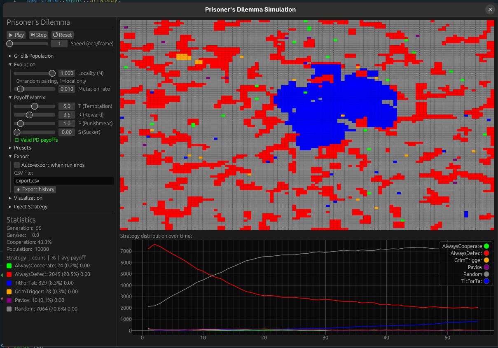

<div align="center">

# 🧬 Evolutionary Prisoner's Dilemma

### *Can cooperation survive in a world of rational self-interest?*

[](https://www.rust-lang.org/)
[](https://github.com/emilk/egui)
[](https://github.com/rayon-rs/rayon)
[](LICENSE)

<br/>



*A 100×100 toroidal grid mid-evolution — colour-coded by strategy. Cooperation (green/blue) clusters resist invasion despite being individually irrational.*

</div>

---

## The Question

In 1950, two RAND mathematicians posed a problem that would haunt game theorists, biologists, and economists for decades: **if defection is always the individually rational choice, why does cooperation exist at all?**

This simulation is a living answer. Watch six competing strategies — from naive altruists to vindictive punishers — fight for survival on a spatially structured grid. The emergent patterns mirror phenomena found in bacterial biofilms, animal behaviour, arms races, and the evolution of social norms.

> *"Cooperation is not a fragile accident. It is a robust attractor of evolutionary dynamics — given space, memory, and repeated interaction."*

---

## Features

| | |
|---|---|
| 🔬 **6 Strategies** | Always Cooperate, Always Defect, Tit-for-Tat, Grim Trigger, Pavlov (Win-Stay Lose-Shift), Random |
| 🌐 **Spatial Structure** | 100×100 toroidal grid with Moore neighbourhood — clustering changes everything |
| 🎛️ **Locality Parameter** | Continuously blend local vs. global opponent selection ($N \in [0, 1]$) |
| ⚡ **Parallel Simulation** | Rayon-powered data-parallel game resolution and reproduction |
| 🧪 **Reproducible Runs** | Seeded RNG — same seed always produces the same initial population |
| 📊 **Live Analytics** | Real-time strategy distribution plot, cooperation rate, per-strategy avg payoff |
| 🎨 **Dual Render Modes** | Strategy colour view or blue→red payoff heatmap overlay |
| 🖱️ **Interactive Grid** | Zoom, pan, and right-click-paint any strategy mid-simulation |
| 💾 **CSV Export** | Full generation-by-generation history export for external analysis |
| 🔧 **Preset System** | Save and load full parameter configurations as JSON |

---

## The Science

### Payoff Matrix

The game is parameterised by four values. For a genuine Prisoner's Dilemma, two conditions must hold:

```
         Opponent: C      Opponent: D
You: C  [ R, R ]         [ S, T ]
You: D  [ T, S ]         [ P, P ]

Default: T=5  R=3  P=1  S=0
```

**Condition 1** — Temptation ordering: `T > R > P > S`  
**Condition 2** — No benefit from turn-taking: `2R > T + S`

The simulation validates these live — a ⚠️ warning appears if your chosen values break the dilemma structure.

### Why Space Matters

In a well-mixed population, defectors always win (Nash equilibrium: mutual defection). Introduce spatial structure and the calculus changes: cooperators form tight clusters that resist invasion. This was first demonstrated computationally by Nowak & May (1992) using a deterministic cellular automaton; this simulation extends their framework with:

- Continuous locality blending (not just local or global)
- Memory-based strategies (TFT, Grim Trigger, Pavlov)
- Imitation-based selection + mutation

### The Six Strategies

| Strategy | Colour | Rule | Biological Analogy |
|---|---|---|---|
| Always Cooperate | 🟢 Green | Always C | Unconditional altruists |
| Always Defect | 🔴 Red | Always D | Parasites, free-riders |
| Tit-for-Tat | 🔵 Blue | C first, then mirror | Axelrod tournament winner — *reciprocal altruism* |
| Grim Trigger | 🟠 Orange | C until first defection, then D forever | Permanent punishment — immune to exploitation |
| Pavlov | 🟣 Purple | Win-Stay, Lose-Shift | Self-correcting — recovers from mutual defection spirals |
| Random | ⚫ Gray | 50/50 each round | Baseline noise / genetic drift |

---

## Getting Started

### Prerequisites

- [Rust](https://rustup.rs/) (stable toolchain)

### Build & Run

```bash
git clone <repo-url>
cd game-of-life-simulation

# Development build
cargo run

# Optimised release build (strongly recommended for performance)
cargo run --release
```

### Controls

| Input | Action |
|---|---|
| `▶ Play` / `⏸ Pause` | Start or stop continuous simulation |
| `⏭ Step` | Advance one generation |
| `↺ Reset` | Re-initialise from seed |
| Scroll wheel | Zoom in/out |
| Left-drag | Pan the grid |
| Double-click | Reset zoom and pan |
| Right-click / right-drag | Paint selected strategy (adjustable brush radius) |
| `⬇ Export history` | Write full generation history to CSV |

---

## Experiments to Try

**Nowak & May clusters** — Set Locality N=1.0, default payoffs. Watch TFT (blue) form fractal-like defensive islands that repel Always Defect (red) invasion.

**Mean-field collapse** — Set N=0.0 (random pairing). Cooperation collapses within ~30 generations, matching the classical game-theory prediction.

**Pavlov vs Grim Trigger** — Set mutation rate to 0.03 and N=0.7. Grim Trigger's permanent punishment chains cascade under noise; Pavlov's self-correction wins out.

**Injection experiment** — Let Always Defect dominate, then right-click-paint a small TFT cluster at high N. Can cooperation re-establish itself? (It can.)

---

## Architecture

```
src/
├── main.rs        — Entry point, native window setup
├── app.rs         — egui App: UI loop, input handling, rendering
├── simulation.rs  — Core engine: step(), reproduce(), analytics
├── agent.rs       — Agent, Strategy, Move, InteractionHistory
├── config.rs      — All parameters (serde-serialisable for presets)
└── export.rs      — CSV history export
```

The simulation runs in two parallel phases each generation:

1. **Game resolution** — `rayon::par_iter` over all interaction pairs; each game reads agent history (immutable) and computes payoffs
2. **Reproduction** — `rayon::par_iter` over all cells; each cell selects the highest-payoff strategy among its 8 Moore neighbours, with mutation

File I/O happens only on explicit export — never inside the simulation loop.

---

## CSV Export Format

The exported file contains one row per generation:

```
Generation,AlwaysCooperate,AlwaysDefect,TitForTat,GrimTrigger,Pavlov,Random
1,1683,1627,1657,1641,1682,1710
2,1512,1834,1698,1590,1723,1643
...
```

Import into Python/R/Excel for post-hoc analysis, plotting, or statistical modelling.

---

## References

- Axelrod, R. (1984). *The Evolution of Cooperation*. Basic Books.
- Nowak, M. A., & May, R. M. (1992). Evolutionary games and spatial chaos. *Nature*, 359, 826–829.
- Milinski, M. (1987). Tit for Tat in sticklebacks and the evolution of cooperation. *Nature*, 325, 433–435.
- Nowak, M. A. (2006). Five rules for the evolution of cooperation. *Science*, 314(5805), 1560–1563.

---

## Documentation

An in-depth tutorial covering the mathematics, strategy analysis, and implementation details is available at:

```
docs/tutorial.html
```

Open it in any browser — it's fully self-contained.

---

<div align="center">

**MIT License** — see [LICENSE](LICENSE)

*Built with Rust • egui • rayon*

</div>
